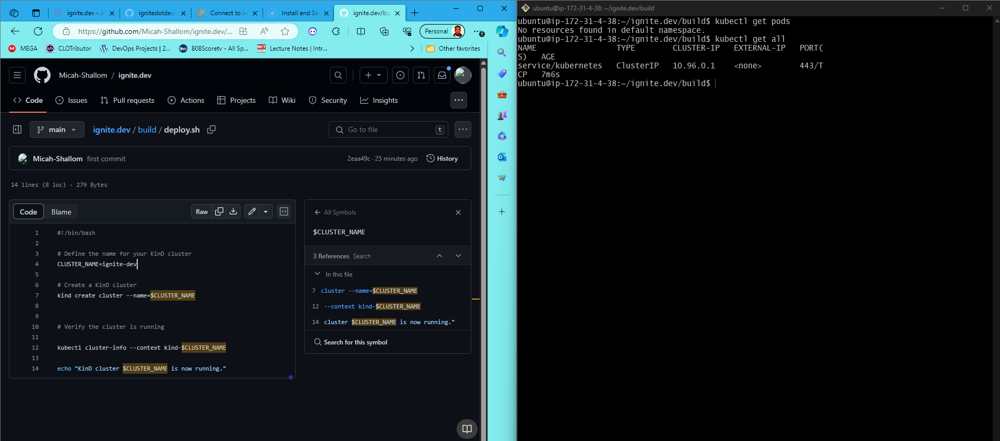
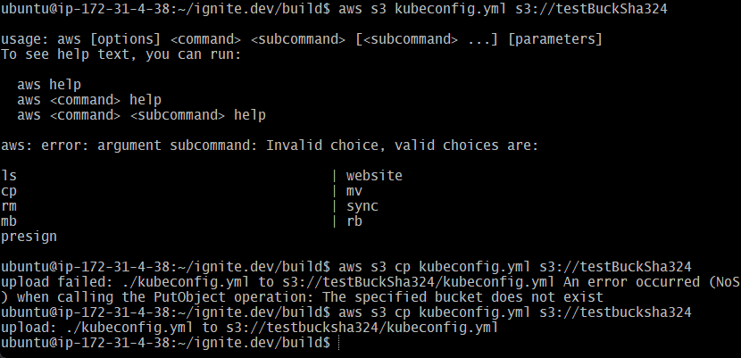
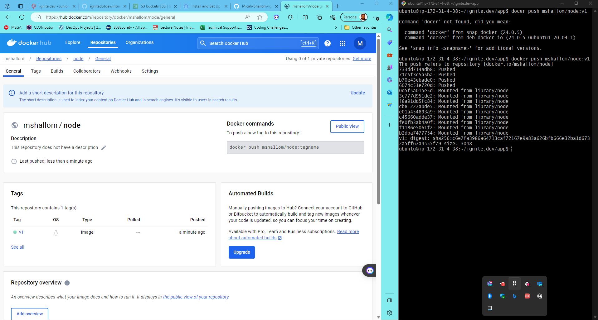
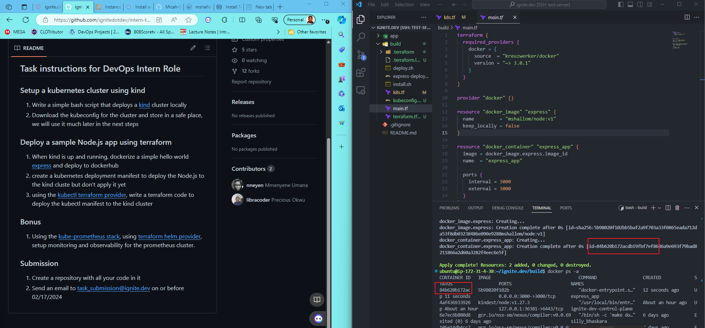
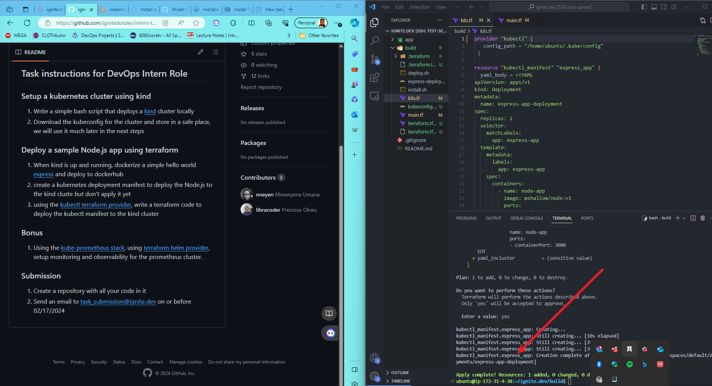
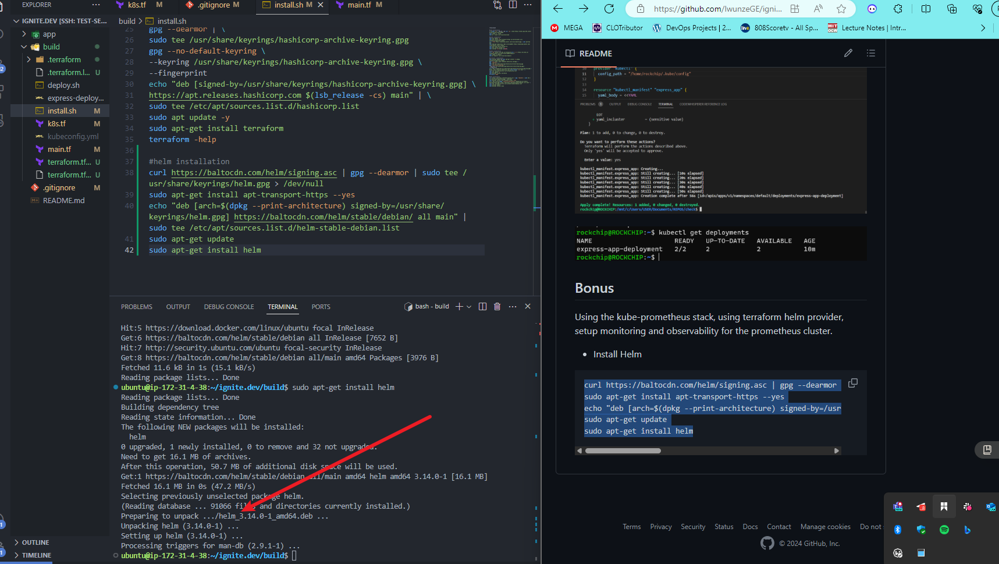
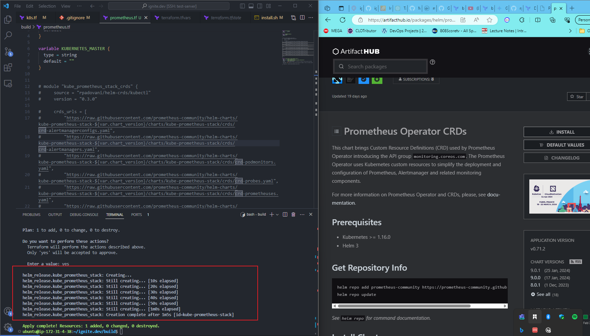
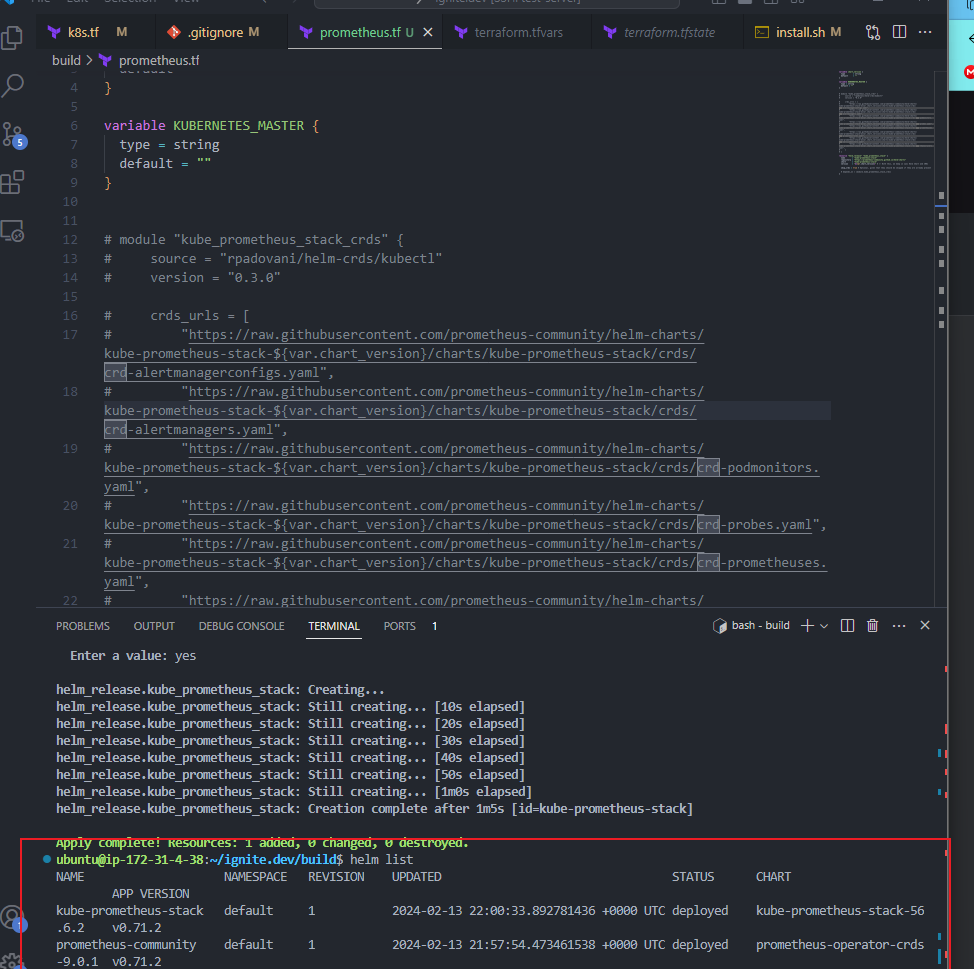

# ignite.dev Task

## Cluster Creation

## Saving Kubeconfig to local PC via S3 bucket

## dockerized application code

## run docker container

## deployed kube mainfest into cluster

## install helm

## setup kube-prometheus stack for cluster monitoring(also setup CRDs for helm chat to work)

## running prometheus pods set for cluster wide monitoring
